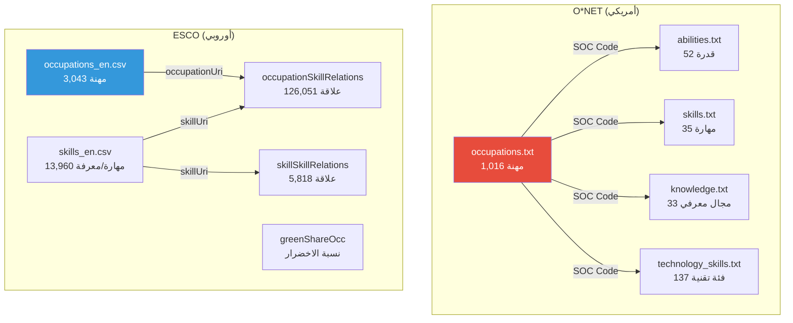

# 📊 بيانات التصنيف المهني (Taxonomy Data)

> قاعدة البيانات المرجعية للمهن والمهارات والمعارف والتقنيات.

---

## 📁 هيكل المجلد

```
taxonomy/
├── onet/                          # بيانات O*NET الأمريكية
│   ├── occupations.txt            # قاموس المهن (1,016 مهنة)
│   ├── abilities.txt              # القدرات البشرية (52 قدرة × 894 مهنة)
│   ├── skills.txt                 # المهارات المهنية (35 مهارة × 894 مهنة)
│   ├── knowledge.txt              # المجالات المعرفية (33 مجال × 894 مهنة)
│   └── technology_skills.txt      # التقنيات والبرمجيات (32,773 سجل × 923 مهنة)
│
└── esco/
    └── ESCO dataset - v1.2.1 - classification - en - csv/
        ├── occupations_en.csv              # المهن الأوروبية (3,043 مهنة)
        ├── skills_en.csv                   # المهارات والمعارف (13,960 عنصر)
        ├── occupationSkillRelations_en.csv  # علاقات مهنة↔مهارة (126,051 علاقة)
        ├── skillSkillRelations_en.csv       # علاقات مهارة↔مهارة (5,818 علاقة)
        ├── skillsHierarchy_en.csv           # الشجرة الهرمية للمهارات
        ├── ISCOGroups_en.csv               # مجموعات ISCO-08
        ├── broaderRelationsOccPillar_en.csv # العلاقات الهرمية للمهن
        ├── broaderRelationsSkillPillar_en.csv # العلاقات الهرمية للمهارات
        ├── greenShareOcc_en.csv            # نسبة الاخضرار البيئي
        ├── transversalSkillsCollection_en.csv # المهارات العابرة
        ├── digitalSkillsCollection_en.csv  # المهارات الرقمية
        ├── languageSkillsCollection_en.csv # مهارات اللغات
        ├── researchSkillsCollection_en.csv # مهارات البحث العلمي
        ├── conceptSchemes_en.csv           # أنظمة التصنيف المفاهيمية
        ├── dictionary_en.csv              # القاموس الشامل لكل المفاهيم
        ├── greenSkillsCollection_en.csv   # مجموعة المهارات الخضراء
        ├──Ede_en.csv                     # تصنيف EDE
        ├── memberSkills_en.csv            # مهارات الأعضاء الإضافية
        └── STIRskillsCollection_en.csv    # مهارات STIR
```

---

## 🇺🇸 القسم الأول: بيانات O*NET


### 📄 `occupations.txt` — قاموس المهن

الملف المرجعي الأساسي الذي يحتوي على كل المهن في نظام O*NET.

| الحقل | الوصف | مثال |
|-------|-------|------|
| `O*NET-SOC Code` | الكود المهني الفريد (نظام SOC) | `11-1011.00` |
| `Title` | المسمى الوظيفي الرسمي | `Chief Executives` |
| `Description` | وصف تفصيلي للمهنة | نص وصفي كامل |

**إحصائيات:**
- **عدد المهن:** 1,016 مهنة
- **الصيغة:** ملف نصي بفاصل Tab
- **بنية الكود:** `XX-XXXX.XX` حيث أول رقمين = المجموعة المهنية الرئيسية

**توزيع المجموعات المهنية (SOC Major Groups):**

| الكود | المجموعة | العدد |
|-------|----------|-------|
| `11-xxxx` | الإدارة (Management) | 59 |
| `13-xxxx` | الأعمال والمالية | 50 |
| `15-xxxx` | الحاسوب والرياضيات | 38 |
| `17-xxxx` | الهندسة والعمارة | 59 |
| `19-xxxx` | العلوم الحياتية والفيزيائية | 66 |
| `21-xxxx` | خدمات المجتمع والاجتماعية | 18 |
| `23-xxxx` | القانون | 8 |
| `25-xxxx` | التعليم والتدريب | 68 |
| `27-xxxx` | الفنون والإعلام | 45 |
| `29-xxxx` | الرعاية الصحية (الممارسون) | 96 |
| `31-xxxx` | الرعاية الصحية (الدعم) | 20 |
| `33-xxxx` | الخدمات الوقائية | 28 |
| `35-xxxx` | إعداد وتقديم الطعام | 18 |
| `37-xxxx` | الصيانة والنظافة | 10 |
| `39-xxxx` | الخدمات الشخصية | 33 |
| `41-xxxx` | المبيعات | 25 |
| `43-xxxx` | الدعم الإداري والمكتبي | 56 |
| `45-xxxx` | الزراعة والصيد | 14 |
| `47-xxxx` | البناء والاستخراج | 56 |
| `49-xxxx` | التركيب والصيانة والإصلاح | 63 |
| `51-xxxx` | الإنتاج والتصنيع | 95 |
| `53-xxxx` | النقل ومناولة المواد | 68 |
| `55-xxxx` | العسكرية | 21 |

> [!IMPORTANT]
> هذا الملف هو **نقطة الربط الأساسية** في النظام. كود `O*NET-SOC Code` هو المفتاح الأساسي (Primary Key) الذي يربط بين جميع ملفات O*NET الأخرى.

---

### 📄 `abilities.txt` — القدرات البشرية

يصف القدرات الفطرية والمكتسبة المطلوبة لأداء كل مهنة، مثل القدرات الذهنية والبدنية والحسية.

| الحقل | الوصف |
|-------|-------|
| `O*NET-SOC Code` | كود المهنة (مفتاح ربط مع `occupations.txt`) |
| `Element ID` | معرّف القدرة الفريد (مثال: `1.A.1.a.1`) |
| `Element Name` | اسم القدرة (مثال: `Oral Comprehension`) |
| `Scale ID` | نوع المقياس: `IM` (الأهمية) أو `LV` (المستوى) |
| `Data Value` | القيمة الرقمية للتقييم |
| `N` | حجم العينة |
| `Standard Error` | الخطأ المعياري |
| `Lower CI Bound` | الحد الأدنى لفاصل الثقة |
| `Upper CI Bound` | الحد الأعلى لفاصل الثقة |
| `Recommend Suppress` | هل يُنصح بإخفاء البيانات (`Y`/`N`) |
| `Not Relevant` | هل القدرة غير ذات صلة بالمهنة (`Y`/`N`/`n/a`) |
| `Date` | تاريخ التحديث (مثال: `08/2023`) |
| `Domain Source` | مصدر البيانات (دائماً `Analyst`) |

**إحصائيات:**
- **إجمالي السجلات:** 92,976
- **عدد المهن المشمولة:** 894
- **عدد القدرات الفريدة:** 52
- **المقاييس:**
  - `IM` (الأهمية): نطاق 1.00 – 5.00، متوسط 2.48
  - `LV` (المستوى): نطاق 0.00 – 6.00، متوسط 2.21
- **حجم العينة:** ثابت = 8 لكل تقييم
- **السجلات الموصى بإخفائها:** 68 من أصل 92,976

**الـ 52 قدرة مصنّفة في 4 مجموعات رئيسية:**

| المجموعة | أمثلة | الترميز |
|----------|-------|---------|
| **القدرات الذهنية** | Oral Comprehension, Deductive Reasoning, Memorization | `1.A.1.x.x` |
| **القدرات الحركية** | Manual Dexterity, Arm-Hand Steadiness, Finger Dexterity | `1.A.2.x.x` |
| **القدرات البدنية** | Static Strength, Stamina, Trunk Strength | `1.A.3.x.x` |
| **القدرات الحسية** | Near Vision, Speech Recognition, Hearing Sensitivity | `1.A.4.x.x` |

> [!NOTE]
> عندما تكون `Not Relevant = Y` فهذا يعني أن القدرة **غير مطلوبة إطلاقاً** لتلك المهنة (مثل `Static Strength` لمهنة `Chief Executives`). القيمة `n/a` تظهر فقط مع مقياس الأهمية `IM` لأن مفهوم "غير ذات صلة" يُقاس فقط على مقياس المستوى `LV`.

---

### 📄 `skills.txt` — المهارات المهنية

يصف المهارات المكتسبة والقابلة للتطوير المطلوبة لكل مهنة.

**الأعمدة:** نفس بنية `abilities.txt` بالضبط (13 عمود).

**إحصائيات:**
- **إجمالي السجلات:** 62,580
- **عدد المهن المشمولة:** 894
- **عدد المهارات الفريدة:** 35
- **المقاييس:**
  - `IM` (الأهمية): نطاق 1.00 – 5.00، متوسط 2.59
  - `LV` (المستوى): نطاق 0.00 – 6.00، متوسط 2.38
- **السجلات الموصى بإخفائها:** 147

**الـ 35 مهارة مصنّفة في 5 مجموعات:**

| المجموعة | المهارات | الترميز |
|----------|---------|---------|
| **المهارات الأساسية - المحتوى** | Reading Comprehension, Active Listening, Writing, Speaking, Mathematics, Science | `2.A.1.x` |
| **المهارات الأساسية - العمليات** | Critical Thinking, Active Learning, Learning Strategies, Monitoring | `2.A.2.x` |
| **المهارات الاجتماعية** | Social Perceptiveness, Coordination, Persuasion, Negotiation, Instructing, Service Orientation | `2.B.1.x` |
| **المهارات التقنية** | Operations Analysis, Technology Design, Equipment Selection, Installation, Programming, Operations Monitoring, Operation and Control, Equipment Maintenance, Troubleshooting, Repairing, Quality Control Analysis | `2.B.3.x` |
| **مهارات حل المشكلات والإدارة** | Complex Problem Solving, Judgment and Decision Making, Systems Analysis, Systems Evaluation, Time Management, Management of Financial/Material/Personnel Resources | `2.B.2.x` – `2.B.5.x` |


---

### 📄 `knowledge.txt` — المجالات المعرفية

يصف المجالات المعرفية والأكاديمية المطلوبة لكل مهنة.

**الأعمدة:** نفس بنية `abilities.txt` (13 عمود)، لكن مع اختلافات جوهرية في البيانات.

**إحصائيات:**
- **إجمالي السجلات:** 59,004
- **عدد المهن المشمولة:** 894
- **عدد المجالات المعرفية:** 33
- **المقاييس:**
  - `IM` (الأهمية): نطاق 1.00 – 5.00، متوسط 2.27
  - `LV` (المستوى): نطاق 0.00 – 6.96، متوسط 2.11
- **حجم العينة (`N`):** متغيّر (11 – 99)، متوسط 25.1 *(على عكس `abilities.txt` و`skills.txt` حيث N=8 ثابت)*
- **السجلات الموصى بإخفائها:** 4,880

**اختلافات جوهرية عن ملفات المهارات والقدرات:**

| الخاصية | `abilities.txt` / `skills.txt` | `knowledge.txt` |
|---------|--------------------------------|-----------------|
| مصدر البيانات | `Analyst` فقط | `Incumbent` + `Occupational Expert` + `Analyst - Transition` |
| حجم العينة (N) | ثابت = 8 | متغير (11 – 99) |
| نطاق مقياس LV | 0.00 – 6.00 | 0.00 – 6.96 |
| نسبة Recommend Suppress | < 0.1% | ~8.3% |

**الـ 33 مجال معرفي:**

| الفئة | المجالات |
|-------|---------|
| **الأعمال والإدارة** | Administration and Management, Administrative, Economics and Accounting, Sales and Marketing, Customer and Personal Service, Personnel and Human Resources |
| **الإنتاج والتصنيع** | Production and Processing, Food Production |
| **التقنية والهندسة** | Computers and Electronics, Engineering and Technology, Design, Building and Construction, Mechanical |
| **العلوم الأساسية** | Mathematics, Physics, Chemistry, Biology |
| **العلوم الإنسانية** | Psychology, Sociology and Anthropology, Geography |
| **الصحة** | Medicine and Dentistry, Therapy and Counseling |
| **التعليم** | Education and Training |
| **اللغة والفنون** | English Language, Foreign Language, Fine Arts, History and Archeology, Philosophy and Theology |
| **القانون والأمن** | Public Safety and Security, Law and Government |
| **الاتصالات** | Telecommunications, Communications and Media, Transportation |

> [!NOTE]
> القيمة `n/a` في حقول `Standard Error`، `Lower CI Bound`، `Upper CI Bound` تظهر عندما يكون مصدر البيانات `Occupational Expert` — في هذه الحالة لا يتم حساب فواصل الثقة الإحصائية لأن البيانات تأتي من تقييمات خبراء وليس من استبيانات إحصائية.

---

### 📄 `technology_skills.txt` — التقنيات والبرمجيات

يربط كل مهنة بالأدوات التقنية والبرمجيات والتكنولوجيا المستخدمة فيها فعلياً.

| الحقل | الوصف | مثال |
|-------|-------|------|
| `O*NET-SOC Code` | كود المهنة | `11-1011.00` |
| `Example` | اسم الأداة/البرنامج المحدد | `Microsoft Excel` |
| `Commodity Code` | كود التصنيف السلعي (UNSPSC) | `43232110` |
| `Commodity Title` | فئة البرنامج | `Spreadsheet software` |
| `Hot Technology` | هل هي تقنية رائجة حالياً (`Y`/`N`) | `Y` |
| `In Demand` | هل هي مطلوبة في سوق العمل (`Y`/`N`) | `Y` |

**إحصائيات:**
- **إجمالي السجلات:** 32,773
- **عدد المهن المشمولة:** 923 *(أكثر من الملفات الأخرى لأنها تشمل تخصصات فرعية)*
- **عدد فئات البرمجيات (Commodity Title):** 137 فئة فريدة
- **عدد الأدوات لكل مهنة:** حد أدنى 1، حد أقصى 429، متوسط 35.5

**توزيع التقنيات الرائجة (Hot Technology):**

| الحالة | العدد | النسبة |
|--------|-------|--------|
| رائجة (`Y`) | 11,526 | 35.2% |
| غير رائجة (`N`) | 21,247 | 64.8% |

**توزيع التقنيات المطلوبة (In Demand):**

| الحالة | العدد | النسبة |
|--------|-------|--------|
| مطلوبة (`Y`) | 2,493 | 7.6% |
| غير مطلوبة (`N`) | 30,280 | 92.4% |

**أكبر 10 فئات برمجية (بعدد السجلات):**

| الفئة | عدد السجلات |
|-------|------------|
| Analytical or scientific software | 2,898 |
| Data base user interface and query software | 2,518 |
| Medical software | 1,614 |
| Word processing software | 1,397 |
| Enterprise resource planning ERP software | 1,264 |
| Development environment software | 1,146 |
| Electronic mail software | 1,141 |
| Computer aided design CAD software | 1,072 |
| Spreadsheet software | 1,058 |
| Operating system software | 980 |

**أمثلة على تقنيات Hot Technology:**
`Python`, `JavaScript`, `SQL`, `Microsoft Excel`, `Tableau`, `AWS`, `Salesforce`, `SAP`, `Oracle`, `Docker`, `Apache Spark`, `R`, `GitHub`, `Jira`, `Slack`, `Zoom`, `Adobe Photoshop`, `AutoCAD`

---

## 🇪🇺 القسم الثاني: بيانات ESCO

**ESCO** (التصنيف الأوروبي للمهارات والكفاءات والمهن) الإصدار **v1.2.1**. يوفر تصنيفاً موازياً ومكمّلاً لـ O*NET مع تغطية أوسع ومنظور أوروبي.

### 📄 `occupations_en.csv` — المهن الأوروبية

| الحقل | الوصف |
|-------|-------|
| `conceptType` | نوع المفهوم (دائماً `Occupation`) |
| `conceptUri` | المعرّف الفريد URI |
| `iscoGroup` | كود ISCO-08 (التصنيف الدولي الموحد للمهن) |
| `preferredLabel` | الاسم المفضّل للمهنة |
| `altLabels` | الأسماء البديلة (مفصولة بسطر جديد `\n`) |
| `description` | وصف تفصيلي للمهنة |
| `regulatedProfessionNote` | حالة التنظيم: `regulated` أو `unregulated` |
| `code` | كود ESCO المحلي |

**إحصائيات:**
- **عدد المهن:** 3,043
- **المهن المنظّمة قانونياً:** 16 فقط (من أصل 3,043)
- **الأسماء البديلة:** 30,417 اسم بديل (متوسط 10 بدائل لكل مهنة، الحد الأقصى 89)
- **المهن التي لها أكواد NACE:** 3,043

**توزيع مجموعات ISCO الرئيسية:**

| الكود | المجموعة | العدد |
|-------|----------|-------|
| 0 | القوات المسلحة | 21 |
| 1 | المديرون | 351 |
| 2 | المتخصصون (Professionals) | 869 |
| 3 | الفنيون والمهنيون المساعدون | 646 |
| 4 | موظفو الدعم الكتابي | 89 |
| 5 | عمال الخدمات والمبيعات | 206 |
| 6 | عمال الزراعة والغابات | 44 |
| 7 | عمال الحرف اليدوية | 394 |
| 8 | مشغلو المصانع والآلات | 347 |
| 9 | المهن الأولية (Elementary) | 76 |


---

### 📄 `skills_en.csv` — المهارات والمعارف

| الحقل | الوصف |
|-------|-------|
| `conceptType` | نوع العنصر |
| `conceptUri` | المعرّف الفريد |
| `skillType` | نوع المهارة: `skill/competence` أو `knowledge` |
| `reuseLevel` | مستوى إعادة الاستخدام |
| `preferredLabel` | الاسم المفضّل |
| `altLabels` | الأسماء البديلة |
| `description` | الوصف التفصيلي |
| `inScheme` | أنظمة التصنيف التي ينتمي إليها |

**إحصائيات:**
- **إجمالي العناصر:** 13,960 (بدون 5 عناصر فارغة)
- **مهارات/كفاءات:** 10,734
- **معارف:** 3,221

**مستويات إعادة الاستخدام (Reuse Level):**

| المستوى | العدد | الوصف |
|---------|-------|-------|
| `sector-specific` | 6,667 | خاصة بقطاع محدد |
| `occupation-specific` | 3,047 | خاصة بمهنة محددة |
| `cross-sector` | 3,788 | عابرة للقطاعات |
| `transversal` | 453 | عابرة لكل المجالات |

**أنظمة التصنيف (In Scheme):**

| النظام | عدد الانتماءات |
|--------|----------------|
| المهارات العامة | 13,960 |
| مهارات الأعضاء | 13,960 |
| تصنيف رقمي (DigComp) | 25 |
| المهارات الخضراء | 629 |
| مجموعات اللغات | 359 |
| المجموعات العابرة | 96 |
| البحث العلمي | 40 |

---

### 📄 `occupationSkillRelations_en.csv` — علاقات المهن بالمهارات

الملف الأهم في ESCO لأنه يربط كل مهنة بالمهارات والمعارف المطلوبة لها.

| الحقل | الوصف |
|-------|-------|
| `occupationUri` | معرّف المهنة |
| `relationType` | نوع العلاقة: `essential` أو `optional` |
| `skillType` | نوع المهارة: `skill/competence` أو `knowledge` |
| `skillUri` | معرّف المهارة |

**إحصائيات:**
- **إجمالي العلاقات:** 126,051
- **علاقات أساسية (essential):** 67,600
- **علاقات اختيارية (optional):** 58,451

**توزيع حسب نوع المهارة:**
- مهارات/كفاءات: 91,608
- معارف: 34,384

**عدد العلاقات لكل مهنة:**
- الحد الأدنى: 7
- الحد الأقصى: 178
- المتوسط: 41.5


---

### 📄 `skillSkillRelations_en.csv` — علاقات المهارات ببعضها

يوضح العلاقات بين المهارات نفسها — أي المهارة تتطلب أو تكمّل مهارة أخرى.

**إحصائيات:**
- **إجمالي العلاقات:** 5,818
- **علاقات اختيارية (optional):** 5,629
- **علاقات أساسية (essential):** 189

**أنماط العلاقات:**

| من → إلى | العدد |
|----------|-------|
| مهارة/كفاءة → معرفة | 5,546 |
| مهارة/كفاءة → مهارة/كفاءة | 223 |
| معرفة → معرفة | 49 |

> [!NOTE]
> الغالبية العظمى (95.3%) هي علاقات من مهارة/كفاءة نحو معرفة، مما يعني أن معظم المهارات العملية **تتطلب اختيارياً** معارف نظرية محددة.

---

### 📄 `skillsHierarchy_en.csv` — الشجرة الهرمية للمهارات

يعرض البنية الشجرية للمهارات بعدة مستويات.

**المستوى 0 (الجذور الأربعة):**

| الفئة | عدد العناصر الفرعية |
|-------|---------------------|
| **knowledge** (معرفة) | 221 |
| **skills** (مهارات) | 385 |
| **transversal skills and competences** (مهارات عابرة) | 31 |
| **language skills and knowledge** (مهارات لغوية) | 3 |

**المستوى 1 (28 فرع):**

| الجذر | الفروع |
|-------|--------|
| **المعارف** | agriculture, arts and humanities, business/administration/law, education, engineering/manufacturing/construction, health and welfare, ICTs, natural sciences/mathematics, services, social sciences/journalism |
| **المهارات** | assisting and caring, communication/collaboration/creativity, constructing, handling and moving, information skills, management skills, working with computers, working with machinery |
| **المهارات العابرة** | core skills, life skills, physical and manual skills, self-management, social and communication, thinking skills |
| **المهارات اللغوية** | classical languages, languages |

---

### 📄 `greenShareOcc_en.csv` — نسبة الاخضرار البيئي

يقيس مدى ارتباط كل مهنة بالاقتصاد الأخضر والاستدامة البيئية.

**إحصائيات:**
- **إجمالي السجلات:** 3,590
- **أنواع المفاهيم:** Occupation (3,039) + ISCO Level 4 (426) + ISCO Level 3 (125)
- **نطاق نسبة الاخضرار:** 0.00 – 0.88

**أعلى 10 مهن من حيث نسبة الاخضرار:**

| المهنة | نسبة الاخضرار |
|--------|---------------|
| Energy assessor | 88.0% |
| Energy conservation officer | 83.3% |
| Environmental policy officer | 82.6% |
| Environmental expert | 81.6% |
| Hazardous waste inspector | 78.8% |
| Sustainability manager | 75.0% |
| Refuse collector | 72.0% |
| Garbage and recycling collectors | 72.0% |
| Natural resources consultant | 71.8% |
| Solid waste operator | 70.0% |

---

### 📄 الملفات المساعدة الأخرى

| الملف | الوصف | الحجم |
|-------|-------|-------|
| `ISCOGroups_en.csv` | مجموعات التصنيف الدولي الموحد ISCO-08 | ~600 مجموعة |
| `broaderRelationsOccPillar_en.csv` | العلاقات الهرمية (أب→ابن) للمهن | يربط المهن بمجموعات ISCO |
| `broaderRelationsSkillPillar_en.csv` | العلاقات الهرمية للمهارات | يبني شجرة المهارات |
| `conceptSchemes_en.csv` | أنظمة التصنيف المفاهيمية | تعريف كل نظام تصنيف |
| `dictionary_en.csv` | القاموس الشامل لكل المفاهيم في ESCO | كل URI مع نوعه واسمه |
| `transversalSkillsCollection_en.csv` | المهارات العابرة للقطاعات | مثل: teamwork, leadership |
| `digitalSkillsCollection_en.csv` | المهارات الرقمية (DigComp) | 25 مهارة رقمية |
| `greenSkillsCollection_en.csv` | المهارات الخضراء | 629 مهارة بيئية |
| `languageSkillsCollection_en.csv` | مهارات اللغات | 359 مهارة لغوية |
| `researchSkillsCollection_en.csv` | مهارات البحث العلمي | 40 مهارة بحثية |
| `memberSkills_en.csv` | مهارات أعضاء إضافية | مهارات لا تنتمي للتصنيف الرسمي |
| `Ede_en.csv` | تصنيف EDE (التعليم الرقمي الأوروبي) | 1,285 مهارة |
| `STIRskillsCollection_en.csv` | مجموعة مهارات STIR | مهارات متخصصة |

---

## 🔗 العلاقات بين مصادر البيانات




---

## 📏 المقاييس المستخدمة في O*NET

### مقياس الأهمية (IM - Importance)
| القيمة | المعنى |
|--------|--------|
| 1 | غير مهم إطلاقاً |
| 2 | قليل الأهمية |
| 3 | مهم |
| 4 | مهم جداً |
| 5 | بالغ الأهمية |

### مقياس المستوى (LV - Level)
| القيمة | المعنى |
|--------|--------|
| 0 | غير مطلوب |
| 1-2 | مستوى مبتدئ |
| 3-4 | مستوى متوسط |
| 5-6 | مستوى متقدم/خبير |

---
