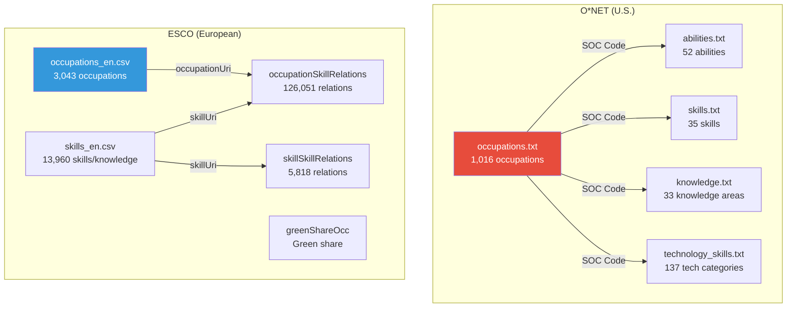

# 📊 Occupational Taxonomy Data

> Reference database for occupations, skills, knowledge areas, and technologies.

---

## 📁 Directory Structure

```
taxonomy/
├── onet/                          # U.S. O*NET data
│   ├── occupations.txt            # Occupations dictionary (1,016 occupations)
│   ├── abilities.txt              # Human abilities (52 abilities × 894 occupations)
│   ├── skills.txt                 # Occupational skills (35 skills × 894 occupations)
│   ├── knowledge.txt              # Knowledge areas (33 areas × 894 occupations)
│   └── technology_skills.txt      # Technologies & software (32,773 records × 923 occupations)
│
└── esco/
    └── ESCO dataset - v1.2.1 - classification - en - csv/
        ├── occupations_en.csv              # European occupations (3,043 occupations)
        ├── skills_en.csv                   # Skills and knowledge (13,960 items)
        ├── occupationSkillRelations_en.csv  # Occupation↔skill relations (126,051 relations)
        ├── skillSkillRelations_en.csv       # Skill↔skill relations (5,818 relations)
        ├── skillsHierarchy_en.csv           # Skills hierarchy tree
        ├── ISCOGroups_en.csv               # ISCO-08 groups
        ├── broaderRelationsOccPillar_en.csv # Hierarchical occupation relations
        ├── broaderRelationsSkillPillar_en.csv # Hierarchical skill relations
        ├── greenShareOcc_en.csv            # Environmental green share
        ├── transversalSkillsCollection_en.csv # Transversal skills
        ├── digitalSkillsCollection_en.csv  # Digital skills
        ├── languageSkillsCollection_en.csv # Language skills
        ├── researchSkillsCollection_en.csv # Research skills
        ├── conceptSchemes_en.csv           # Conceptual classification systems
        ├── dictionary_en.csv              # Comprehensive concept dictionary
        ├── greenSkillsCollection_en.csv   # Green skills collection
        ├── Ede_en.csv                     # EDE classification
        ├── memberSkills_en.csv            # Additional member skills
        └── STIRskillsCollection_en.csv    # STIR skills
```

---

## 🇺🇸 Section 1: O\*NET Data


### 📄 `occupations.txt` — Occupations Dictionary

The primary reference file containing all occupations in the O\*NET system.

| Field | Description | Example |
|-------|-------------|---------|
| `O*NET-SOC Code` | Unique occupational code (SOC system) | `11-1011.00` |
| `Title` | Official job title | `Chief Executives` |
| `Description` | Detailed occupation description | Full descriptive text |

**Statistics:**
- **Number of occupations:** 1,016
- **Format:** Tab-delimited text file
- **Code structure:** `XX-XXXX.XX` where the first two digits = major occupational group

**SOC Major Group Distribution:**

| Code | Group | Count |
|------|-------|-------|
| `11-xxxx` | Management | 59 |
| `13-xxxx` | Business and Financial | 50 |
| `15-xxxx` | Computer and Mathematical | 38 |
| `17-xxxx` | Architecture and Engineering | 59 |
| `19-xxxx` | Life, Physical, and Social Science | 66 |
| `21-xxxx` | Community and Social Service | 18 |
| `23-xxxx` | Legal | 8 |
| `25-xxxx` | Educational Instruction and Library | 68 |
| `27-xxxx` | Arts, Design, Entertainment, and Media | 45 |
| `29-xxxx` | Healthcare Practitioners | 96 |
| `31-xxxx` | Healthcare Support | 20 |
| `33-xxxx` | Protective Service | 28 |
| `35-xxxx` | Food Preparation and Serving | 18 |
| `37-xxxx` | Building and Grounds Cleaning | 10 |
| `39-xxxx` | Personal Care and Service | 33 |
| `41-xxxx` | Sales | 25 |
| `43-xxxx` | Office and Administrative Support | 56 |
| `45-xxxx` | Farming, Fishing, and Forestry | 14 |
| `47-xxxx` | Construction and Extraction | 56 |
| `49-xxxx` | Installation, Maintenance, and Repair | 63 |
| `51-xxxx` | Production | 95 |
| `53-xxxx` | Transportation and Material Moving | 68 |
| `55-xxxx` | Military Specific | 21 |

> [!IMPORTANT]
> This file is the **primary linking point** in the system. The `O*NET-SOC Code` is the primary key that connects all other O\*NET files.

---

### 📄 `abilities.txt` — Human Abilities

Describes innate and acquired abilities required to perform each occupation, including cognitive, psychomotor, physical, and sensory abilities.

| Field | Description |
|-------|-------------|
| `O*NET-SOC Code` | Occupation code (links to `occupations.txt`) |
| `Element ID` | Unique ability identifier (e.g., `1.A.1.a.1`) |
| `Element Name` | Ability name (e.g., `Oral Comprehension`) |
| `Scale ID` | Scale type: `IM` (Importance) or `LV` (Level) |
| `Data Value` | Numerical assessment value |
| `N` | Sample size |
| `Standard Error` | Standard error |
| `Lower CI Bound` | Lower confidence interval bound |
| `Upper CI Bound` | Upper confidence interval bound |
| `Recommend Suppress` | Whether to suppress data (`Y`/`N`) |
| `Not Relevant` | Whether ability is irrelevant to occupation (`Y`/`N`/`n/a`) |
| `Date` | Update date (e.g., `08/2023`) |
| `Domain Source` | Data source (always `Analyst`) |

**Statistics:**
- **Total records:** 92,976
- **Occupations covered:** 894
- **Unique abilities:** 52
- **Scales:**
  - `IM` (Importance): Range 1.00 – 5.00, mean 2.48
  - `LV` (Level): Range 0.00 – 6.00, mean 2.21
- **Sample size:** Fixed at 8 per assessment
- **Records recommended for suppression:** 68 out of 92,976

**The 52 abilities classified into 4 major groups:**

| Group | Examples | Code |
|-------|---------|------|
| **Cognitive Abilities** | Oral Comprehension, Deductive Reasoning, Memorization | `1.A.1.x.x` |
| **Psychomotor Abilities** | Manual Dexterity, Arm-Hand Steadiness, Finger Dexterity | `1.A.2.x.x` |
| **Physical Abilities** | Static Strength, Stamina, Trunk Strength | `1.A.3.x.x` |
| **Sensory Abilities** | Near Vision, Speech Recognition, Hearing Sensitivity | `1.A.4.x.x` |

> [!NOTE]
> When `Not Relevant = Y`, it means the ability is **not required at all** for that occupation (e.g., `Static Strength` for `Chief Executives`). The value `n/a` appears only with the Importance scale `IM` because the "not relevant" concept is only measured on the Level scale `LV`.

---

### 📄 `skills.txt` — Occupational Skills

Describes acquired and developable skills required for each occupation.

**Columns:** Same structure as `abilities.txt` (13 columns).

**Statistics:**
- **Total records:** 62,580
- **Occupations covered:** 894
- **Unique skills:** 35
- **Scales:**
  - `IM` (Importance): Range 1.00 – 5.00, mean 2.59
  - `LV` (Level): Range 0.00 – 6.00, mean 2.38
- **Records recommended for suppression:** 147

**The 35 skills classified into 5 groups:**

| Group | Skills | Code |
|-------|--------|------|
| **Basic Skills - Content** | Reading Comprehension, Active Listening, Writing, Speaking, Mathematics, Science | `2.A.1.x` |
| **Basic Skills - Process** | Critical Thinking, Active Learning, Learning Strategies, Monitoring | `2.A.2.x` |
| **Social Skills** | Social Perceptiveness, Coordination, Persuasion, Negotiation, Instructing, Service Orientation | `2.B.1.x` |
| **Technical Skills** | Operations Analysis, Technology Design, Equipment Selection, Installation, Programming, Operations Monitoring, Operation and Control, Equipment Maintenance, Troubleshooting, Repairing, Quality Control Analysis | `2.B.3.x` |
| **Problem Solving & Management** | Complex Problem Solving, Judgment and Decision Making, Systems Analysis, Systems Evaluation, Time Management, Management of Financial/Material/Personnel Resources | `2.B.2.x` – `2.B.5.x` |


---

### 📄 `knowledge.txt` — Knowledge Areas

Describes the academic and professional knowledge areas required for each occupation.

**Columns:** Same structure as `abilities.txt` (13 columns), but with significant data differences.

**Statistics:**
- **Total records:** 59,004
- **Occupations covered:** 894
- **Unique knowledge areas:** 33
- **Scales:**
  - `IM` (Importance): Range 1.00 – 5.00, mean 2.27
  - `LV` (Level): Range 0.00 – 6.96, mean 2.11
- **Sample size (`N`):** Variable (11 – 99), mean 25.1 *(unlike `abilities.txt` and `skills.txt` where N=8 is constant)*
- **Records recommended for suppression:** 4,880

**Key differences from skills and abilities files:**

| Property | `abilities.txt` / `skills.txt` | `knowledge.txt` |
|----------|-------------------------------|-----------------|
| Data source | `Analyst` only | `Incumbent` + `Occupational Expert` + `Analyst - Transition` |
| Sample size (N) | Fixed = 8 | Variable (11 – 99) |
| LV scale range | 0.00 – 6.00 | 0.00 – 6.96 |
| Recommend Suppress rate | < 0.1% | ~8.3% |

**The 33 knowledge areas:**

| Category | Areas |
|----------|-------|
| **Business & Management** | Administration and Management, Administrative, Economics and Accounting, Sales and Marketing, Customer and Personal Service, Personnel and Human Resources |
| **Production & Manufacturing** | Production and Processing, Food Production |
| **Technology & Engineering** | Computers and Electronics, Engineering and Technology, Design, Building and Construction, Mechanical |
| **Basic Sciences** | Mathematics, Physics, Chemistry, Biology |
| **Social Sciences** | Psychology, Sociology and Anthropology, Geography |
| **Health** | Medicine and Dentistry, Therapy and Counseling |
| **Education** | Education and Training |
| **Language & Arts** | English Language, Foreign Language, Fine Arts, History and Archeology, Philosophy and Theology |
| **Law & Security** | Public Safety and Security, Law and Government |
| **Communications** | Telecommunications, Communications and Media, Transportation |

> [!NOTE]
> The value `n/a` in `Standard Error`, `Lower CI Bound`, and `Upper CI Bound` fields appears when the data source is `Occupational Expert` — in this case, statistical confidence intervals are not computed because the data comes from expert evaluations rather than statistical surveys.

---

### 📄 `technology_skills.txt` — Technologies & Software

Links each occupation to the technical tools, software, and technology actually used in it.

| Field | Description | Example |
|-------|-------------|---------|
| `O*NET-SOC Code` | Occupation code | `11-1011.00` |
| `Example` | Specific tool/software name | `Microsoft Excel` |
| `Commodity Code` | UNSPSC commodity classification code | `43232110` |
| `Commodity Title` | Software category | `Spreadsheet software` |
| `Hot Technology` | Whether it's a currently trending technology (`Y`/`N`) | `Y` |
| `In Demand` | Whether it's in demand in the job market (`Y`/`N`) | `Y` |

**Statistics:**
- **Total records:** 32,773
- **Occupations covered:** 923 *(more than other files because it includes sub-specializations)*
- **Unique software categories (Commodity Title):** 137
- **Tools per occupation:** Min 1, Max 429, Mean 35.5

**Hot Technology distribution:**

| Status | Count | Percentage |
|--------|-------|------------|
| Hot (`Y`) | 11,526 | 35.2% |
| Not Hot (`N`) | 21,247 | 64.8% |

**In Demand distribution:**

| Status | Count | Percentage |
|--------|-------|------------|
| In Demand (`Y`) | 2,493 | 7.6% |
| Not In Demand (`N`) | 30,280 | 92.4% |

**Top 10 software categories (by record count):**

| Category | Records |
|----------|---------|
| Analytical or scientific software | 2,898 |
| Data base user interface and query software | 2,518 |
| Medical software | 1,614 |
| Word processing software | 1,397 |
| Enterprise resource planning ERP software | 1,264 |
| Development environment software | 1,146 |
| Electronic mail software | 1,141 |
| Computer aided design CAD software | 1,072 |
| Spreadsheet software | 1,058 |
| Operating system software | 980 |

**Examples of Hot Technologies:**
`Python`, `JavaScript`, `SQL`, `Microsoft Excel`, `Tableau`, `AWS`, `Salesforce`, `SAP`, `Oracle`, `Docker`, `Apache Spark`, `R`, `GitHub`, `Jira`, `Slack`, `Zoom`, `Adobe Photoshop`, `AutoCAD`

---

## 🇪🇺 Section 2: ESCO Data

**ESCO** (European Skills, Competences, Qualifications and Occupations) version **v1.2.1**. Provides a parallel and complementary classification to O\*NET with broader coverage and a European perspective.

### 📄 `occupations_en.csv` — European Occupations

| Field | Description |
|-------|-------------|
| `conceptType` | Concept type (always `Occupation`) |
| `conceptUri` | Unique URI identifier |
| `iscoGroup` | ISCO-08 code (International Standard Classification of Occupations) |
| `preferredLabel` | Preferred occupation name |
| `altLabels` | Alternative names (separated by newline `\n`) |
| `description` | Detailed occupation description |
| `regulatedProfessionNote` | Regulation status: `regulated` or `unregulated` |
| `code` | Local ESCO code |

**Statistics:**
- **Number of occupations:** 3,043
- **Legally regulated occupations:** 16 only (out of 3,043)
- **Alternative names:** 30,417 alternatives (average 10 per occupation, max 89)
- **Occupations with NACE codes:** 3,043

**ISCO Major Group Distribution:**

| Code | Group | Count |
|------|-------|-------|
| 0 | Armed Forces | 21 |
| 1 | Managers | 351 |
| 2 | Professionals | 869 |
| 3 | Technicians and Associate Professionals | 646 |
| 4 | Clerical Support Workers | 89 |
| 5 | Service and Sales Workers | 206 |
| 6 | Skilled Agricultural, Forestry and Fishery Workers | 44 |
| 7 | Craft and Related Trades Workers | 394 |
| 8 | Plant and Machine Operators, and Assemblers | 347 |
| 9 | Elementary Occupations | 76 |


---

### 📄 `skills_en.csv` — Skills and Knowledge

| Field | Description |
|-------|-------------|
| `conceptType` | Item type |
| `conceptUri` | Unique identifier |
| `skillType` | Skill type: `skill/competence` or `knowledge` |
| `reuseLevel` | Reuse level |
| `preferredLabel` | Preferred name |
| `altLabels` | Alternative names |
| `description` | Detailed description |
| `inScheme` | Classification systems it belongs to |

**Statistics:**
- **Total items:** 13,960 (excluding 5 empty items)
- **Skills/competences:** 10,734
- **Knowledge:** 3,221

**Reuse Levels:**

| Level | Count | Description |
|-------|-------|-------------|
| `sector-specific` | 6,667 | Specific to a particular sector |
| `occupation-specific` | 3,047 | Specific to a particular occupation |
| `cross-sector` | 3,788 | Applicable across sectors |
| `transversal` | 453 | Applicable across all domains |

**Classification Systems (In Scheme):**

| System | Membership Count |
|--------|-----------------|
| General Skills | 13,960 |
| Member Skills | 13,960 |
| Digital Classification (DigComp) | 25 |
| Green Skills | 629 |
| Language Collections | 359 |
| Transversal Collections | 96 |
| Research | 40 |

---

### 📄 `occupationSkillRelations_en.csv` — Occupation-Skill Relations

The most important file in ESCO as it links each occupation to its required skills and knowledge.

| Field | Description |
|-------|-------------|
| `occupationUri` | Occupation identifier |
| `relationType` | Relation type: `essential` or `optional` |
| `skillType` | Skill type: `skill/competence` or `knowledge` |
| `skillUri` | Skill identifier |

**Statistics:**
- **Total relations:** 126,051
- **Essential relations:** 67,600
- **Optional relations:** 58,451

**Distribution by skill type:**
- Skills/competences: 91,608
- Knowledge: 34,384

**Relations per occupation:**
- Minimum: 7
- Maximum: 178
- Mean: 41.5


---

### 📄 `skillSkillRelations_en.csv` — Skill-to-Skill Relations

Shows relationships between skills themselves — which skill requires or complements another.

**Statistics:**
- **Total relations:** 5,818
- **Optional relations:** 5,629
- **Essential relations:** 189

**Relation patterns:**

| From → To | Count |
|-----------|-------|
| Skill/competence → Knowledge | 5,546 |
| Skill/competence → Skill/competence | 223 |
| Knowledge → Knowledge | 49 |

> [!NOTE]
> The vast majority (95.3%) are relations from skill/competence to knowledge, meaning most practical skills **optionally require** specific theoretical knowledge.

---

### 📄 `skillsHierarchy_en.csv` — Skills Hierarchy Tree

Displays the hierarchical tree structure of skills at multiple levels.

**Level 0 (The Four Roots):**

| Category | Number of Sub-items |
|----------|-------------------|
| **knowledge** | 221 |
| **skills** | 385 |
| **transversal skills and competences** | 31 |
| **language skills and knowledge** | 3 |

**Level 1 (28 Branches):**

| Root | Branches |
|------|----------|
| **Knowledge** | agriculture, arts and humanities, business/administration/law, education, engineering/manufacturing/construction, health and welfare, ICTs, natural sciences/mathematics, services, social sciences/journalism |
| **Skills** | assisting and caring, communication/collaboration/creativity, constructing, handling and moving, information skills, management skills, working with computers, working with machinery |
| **Transversal** | core skills, life skills, physical and manual skills, self-management, social and communication, thinking skills |
| **Language** | classical languages, languages |

---

### 📄 `greenShareOcc_en.csv` — Environmental Green Share

Measures how closely each occupation is related to the green economy and environmental sustainability.

**Statistics:**
- **Total records:** 3,590
- **Concept types:** Occupation (3,039) + ISCO Level 4 (426) + ISCO Level 3 (125)
- **Green share range:** 0.00 – 0.88

**Top 10 occupations by green share:**

| Occupation | Green Share |
|------------|-------------|
| Energy assessor | 88.0% |
| Energy conservation officer | 83.3% |
| Environmental policy officer | 82.6% |
| Environmental expert | 81.6% |
| Hazardous waste inspector | 78.8% |
| Sustainability manager | 75.0% |
| Refuse collector | 72.0% |
| Garbage and recycling collectors | 72.0% |
| Natural resources consultant | 71.8% |
| Solid waste operator | 70.0% |

---

### 📄 Other Supporting Files

| File | Description | Size |
|------|-------------|------|
| `ISCOGroups_en.csv` | ISCO-08 International Standard Classification groups | ~600 groups |
| `broaderRelationsOccPillar_en.csv` | Hierarchical (parent→child) relations for occupations | Links occupations to ISCO groups |
| `broaderRelationsSkillPillar_en.csv` | Hierarchical relations for skills | Builds the skills tree |
| `conceptSchemes_en.csv` | Conceptual classification systems | Each classification system definition |
| `dictionary_en.csv` | Comprehensive dictionary of all ESCO concepts | Every URI with its type and name |
| `transversalSkillsCollection_en.csv` | Transversal (cross-sector) skills | e.g., teamwork, leadership |
| `digitalSkillsCollection_en.csv` | Digital skills (DigComp) | 25 digital skills |
| `greenSkillsCollection_en.csv` | Green skills | 629 environmental skills |
| `languageSkillsCollection_en.csv` | Language skills | 359 language skills |
| `researchSkillsCollection_en.csv` | Research skills | 40 research skills |
| `memberSkills_en.csv` | Additional member skills | Skills not in official classification |
| `Ede_en.csv` | EDE classification (European Digital Education) | 1,285 skills |
| `STIRskillsCollection_en.csv` | STIR skills collection | Specialized skills |

---

## 🔗 Relationships Between Data Sources




---

## 📏 Scales Used in O\*NET

### Importance Scale (IM)
| Value | Meaning |
|-------|---------|
| 1 | Not important at all |
| 2 | Somewhat important |
| 3 | Important |
| 4 | Very important |
| 5 | Extremely important |

### Level Scale (LV)
| Value | Meaning |
|-------|---------|
| 0 | Not required |
| 1-2 | Beginner level |
| 3-4 | Intermediate level |
| 5-6 | Advanced/Expert level |

---
